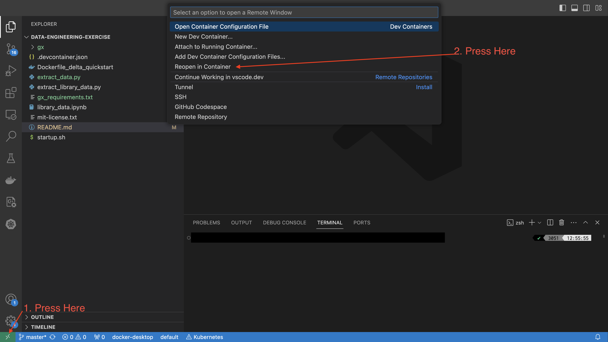
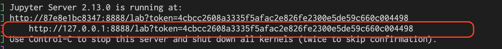
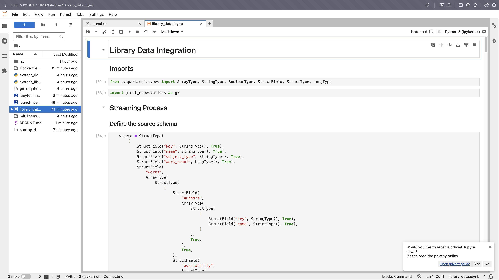

# Data Engineering Exercise

## Objective:
Design a simplified version of a data pipeline using a real-world scenario. The exercise focuses on your ability to integrate data from an external API, process it, and present insights in a manner that's valuable for product and analytics teams.

## Scenario:
 You are a part of a small online book company and your company wants to expand on the books provided by their online store. Your task if you choose to accept it, is to develop a mini data pipeline that extracts data from [Open Library's API](https://openlibrary.org/developers/api), focusing on a [subject](https://openlibrary.org/dev/docs/api/subjects) of your choice.

This pipeline will be generalized for production use at a later date as the company wishes to perform similar analysis in the future. The data to be extracted includes a list of authors and books related to your chosen subject.

## Key Deliverables
1. **Architecture Overview**:

   ### Approach taken
   I chose to use python to retrieve the data from the API. Python provides a lightweight library called `requests` that allows for relatively simple url data requests over the internet. Once data is retrieved it is important to store it in the same state it was retrieved. I believe the data should be first persisted in the form of a file in a storage bucket. Doing this allows us to look back to the original state of the API request at that point in time.

   Once the raw data is stored in an S3 bucket, we can begin cleaning/querying the contents of all files. We can use a districuted processing framework to stream the raw, transform it to our liking and save the desired  output to a new location in S3.

   Services to be used:
      - Data extraction will be done by a Python script. This will run on an EC2 instance.
      - Data Storage. After the script has retrieved the API response. The contents will be stored on Amazon S3. A custom logic will be responsible for creating the file name.
      - Spark will be used to do the data cleansing. We can use EMR Notebook or databricks to stream data from the raw directory to the separate `books` and `authors` tables.

   Flow Diagram
   ```mermaid
   graph LR
      API ----> EC2[Pull data from API]
      EC2 --> S3
      S3 --> EMR[EMR/Databricks]
      EMR -- Stream Transform --> s3_books[Books Silver]
      EMR -- Stream Transform --> s3_authors[Authors Silver]
      s3_books --> save_books[Save Books CSV]
      s3_authors --> save_authors[Save Authors CSV]
      s3_books --> answer_q1[Answer SQL Q1]
      s3_authors --> answer_q2[Answer SQL Q2]
   ```


2. Setup
---
You'll need to have [Docker](https://www.docker.com/products/docker-desktop/) as well as [VIsual Studio Code](https://code.visualstudio.com/download) installed to properly run this environment locally.

Once you've downloaded the required software and cloned the repo, you're ready to begin!
   
   1. Open up Visual Studio Code (VS Code) and at the top left of click `File` -> `Open`
   2. Find and select the recently cloned repo. Press `Open`

   Once that's done, you should see that the project becomes your main workspace folder. With the repository as your main folder, follow the instructions in the image below:

   
   Congrats!! You're in the container!


3. Executing Process
---
1. The first script you'll need to run is `extract_library_data.py`. This will:
   1. Extract data from API
   2. Create new file name
   3. Store data in a file

   To run the extract, open `extract_library_data.py` then press `F5` on your keyboard

2. Once that's complete, you'll need to launch startup.sh in the terminal by running
```
bash startup.sh
```
This command will start your jupyter server. Be aware of the link that it will print out. This is what you'll use to run the notebook.


3. Copy the link to your browser of choice

4. Run commands:
   Once you're on the jupyter server, you can run the notebook `library_data.ipynb`!
   